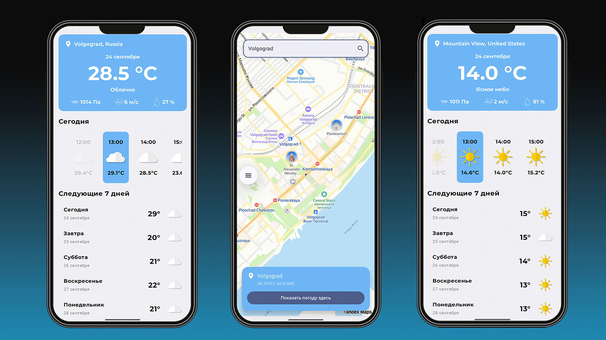

<div align="center">
  <h1>WeatherInfoHelper</h1>
  <p><em>Android-приложение на Kotlin для просмотра прогноза погоды с поиском локаций на карте</em></p>

  [](https://kotlinlang.org)
  [](https://developer.android.com/jetpack/compose)
  [](https://www.android.com)

  <br>

  []()
</div>

---

## 🌤️О проекте

**WeatherInfoHelper** — Android-приложение на Kotlin для просмотра актуальной и почасовой погоды. Пользователь может определить своё текущее местоположение автоматически или выбрать точку на карте, после чего приложение покажет прогноз для выбранных координат.

Архитектура построена по принципам **Clean Architecture** с разделением на слои `presentation` / `domain` / `data` и внедрением зависимостей через **Hilt**.

---

## 🌤️Основные возможности

- 📍 Определение текущего местоположения пользователя
- 🗺️ Выбор локации на карте (Yandex MapKit) с поиском мест
- 🌡️ Информация о текущей погоде
- ⏱️ Почасовой прогноз
- 🔐 Запрос и обработка разрешений на геолокацию

---

## 🌤️Скриншоты

<div align="center">
  
</div>

---

## 🌤️Технологии и архитектура

- **Kotlin** + **Jetpack Compose** — интерфейс приложения
- **Clean Architecture**: `presentation` → `domain` → `data`
- **Hilt** — dependency injection
- **Retrofit** — работа с погодным API ([Open-Meteo](https://open-meteo.com))
- **Yandex MapKit** — карта, поиск мест и геокодирование
- **Navigation Compose** — навигация между экранами (Weather / Map)
- **FusedLocationProviderClient** — получение текущей геолокации

---

## 🌤️API

Приложение получает данные о погоде через **Open-Meteo Forecast API** по координатам выбранной локации:

- `GET /v1/forecast` — текущая и почасовая погода (температура, влажность, скорость ветра, давление, код погодных условий)

Для работы с картой, поиском мест и геокодированием используется **Yandex MapKit**.

---

## 🌤️Установка и запуск

```bash
git clone https://github.com/<your-username>/weatherinfohelper.git
```

Откройте проект в **Android Studio** и добавьте свой ключ Yandex MapKit в `local.properties`:

```properties
MAPKIT_API_KEY=your_yandex_mapkit_api_key
```

Запустите приложение


